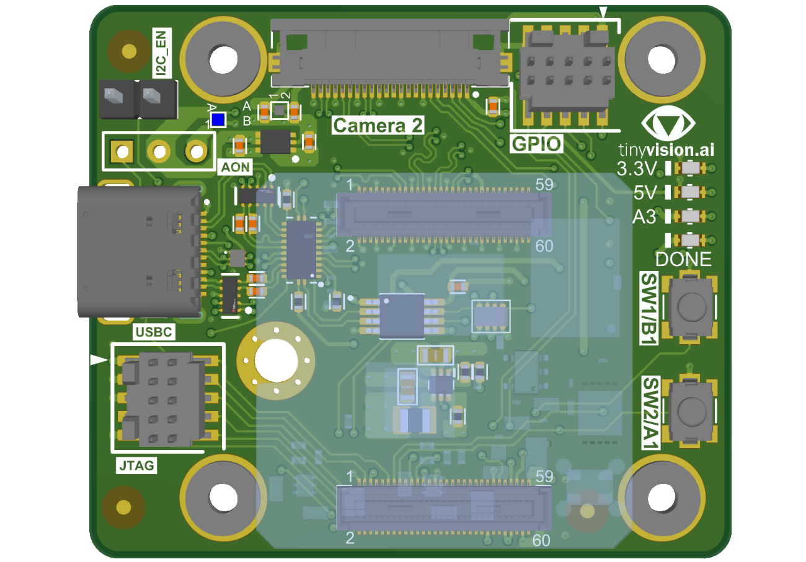

# tinyCLUNX33 reference design: dual MIPI to USB

[Schematics](tinyCamera_v1.0_Schematic.pdf) |
[Assembly](tinyCamera_v1.0_Assembly.pdf)

This is a reference hardware design to show how it is possible to build a compact camera device
USB3 camera device: turning the tinyCLUNX33 SoM into a product.

Features:
- All SoM pins exposed, additional probing and voltage pins
- Inexpensive 4-layer board
- USB3 at 5 Gbit/s integrated with a Type-C port controller
- GPIO LED and push button

Connectors:
- 1 × USB-C connectors for the FPGA 5 Gbit/s interfaces
- 1 × MIPI Raspberry Pi Camera FPC connector with 
- 1 × MIPI Hirose connector
- 2 × IDC 1.27mm connector for JTAG, SPI flash, I2C, GPIO
- Extra headers for EN signals and power rails

Mechanical:
- Compact form factor fitting a small device
- No-tool setup of the SoM helping factory programming
- Mounting holes matching the Raspberry Pi Camera HQ layout

## Pinout

TODO: switch to v2 and document the pinout as tables

## Parts featured

- Hirose
  [DF37NC-30DS-0.4V](https://www.hirose.com/product/p/CL0684-3313-5-51)
  30-pin connector

- Molex
  [0545482271](https://www.molex.com/en-us/products/part-detail/545482271)
  0.50mm Pitch FFC/FPC Connector

- Diodes
  [PI5USB30213A](https://www.diodes.com/assets/Databriefs/PI5USB30213A-Product-Brief.pdf)
  Type-C Dual Role Port Controller

